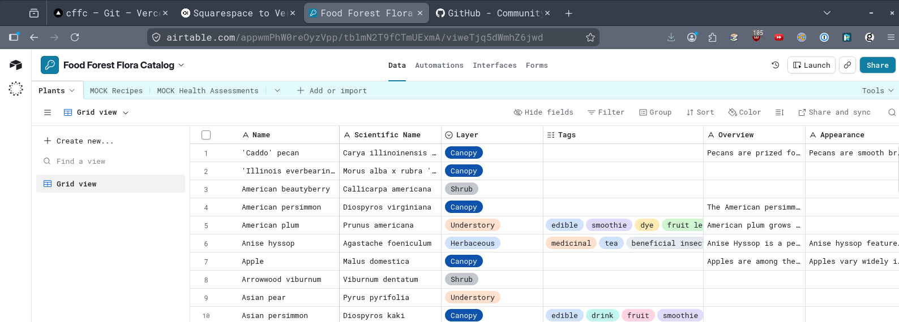
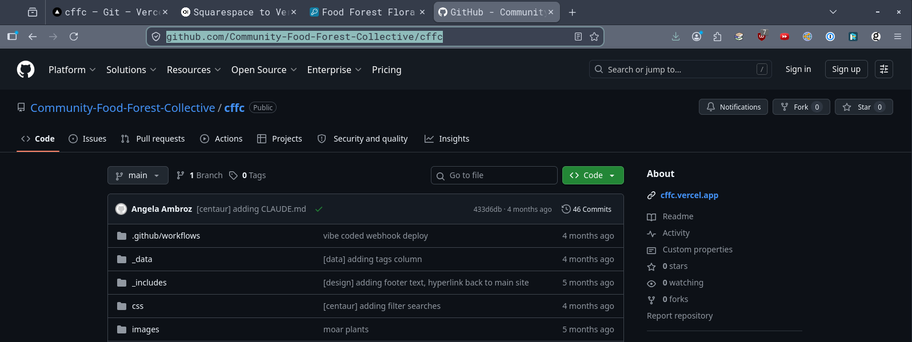
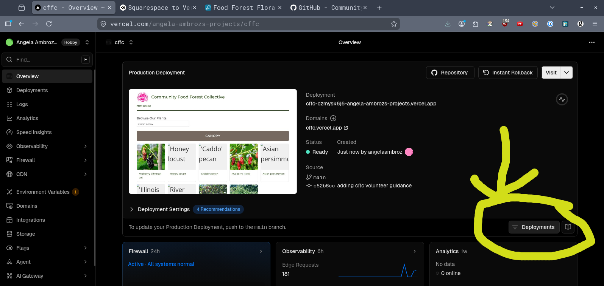
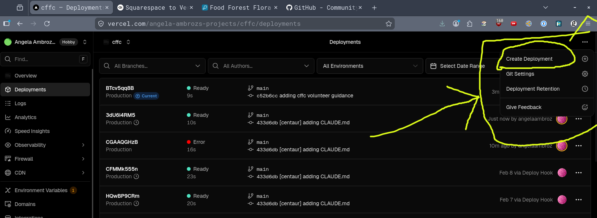

# 🌿 How to Update the CFFC Plant Catalog

Updating our website is a two-step process: First, you update the information in our "digital filing cabinet" (Airtable), and then you tell the website to "refresh" itself to show those changes.

## Step 1: Update the Plant Information

We keep all our plant details (like names, photos, and health status) in a tool called [Airtable](https://airtable.com/). It looks and acts just like a spreadsheet.

- Open the [Airtable link](https://airtable.com/appwmPhW0reOyzVpp?).
- To add a new plant: Scroll to the very bottom of the list and fill out a new row. Type the name, description, and any other details in the boxes.
- To edit a plant: Simply click on the box you want to change (like a plant's description) and type over the old text. 
- To add a photo: Drag and drop an image file from your computer directly into the "Attachments" or "Photo" column for that plant.

Your changes in Airtable are saved automatically. 

## Step 2: Refresh the Website (The "Publish" Button)

Our website's code lives in GitHub, a code hosting platform. You can find it here: [https://github.com/Community-Food-Forest-Collective/cffc](https://github.com/Community-Food-Forest-Collective/cffc) If you want to change anything about the formatting (font, colors, heading sizes, etc.), you can do that here.

When you want to update the website with the Airtable changes, you need to "deploy to production" - this means "publishing" your changes to the live website. We use another platform to publish the website code to the internet: [Vercel](https://vercel.com/angela-ambrozs-projects/cffc) When Vercel publishes the website, it pulls from whatever's on Airtable and automatically generates each plant page, for example.

How to publish:
- Open the Vercel link: [https://vercel.com/angela-ambrozs-projects/cffc](https://vercel.com/angela-ambrozs-projects/cffc) 
- Log In: Use the email address associated with the account.
- Look for the most recent "Deployment" at the top of the list.

- Click the button with three little dots (...) on the right side.
- Select `Create deployment` from the menu.

Wait for the Green Light: You will see a status bar that says "Building." Once it turns green and says "Ready," your changes are officially live on the website! You can double check on [https://plants.foodforestcollective.org/](https://plants.foodforestcollective.org)

## Helpful Tips

- Airtable = Where the information lives .
- Vercel Redeploy = The "Publish" button that tells the website to fetch the new info .
- Don't panic: You cannot "break" the website by editing Airtable. The website only changes when you "publish" changes via Vercel.
